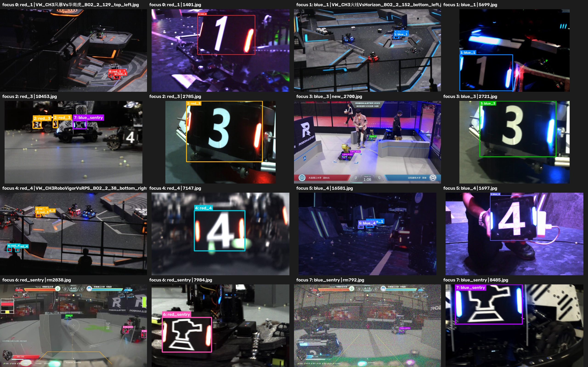
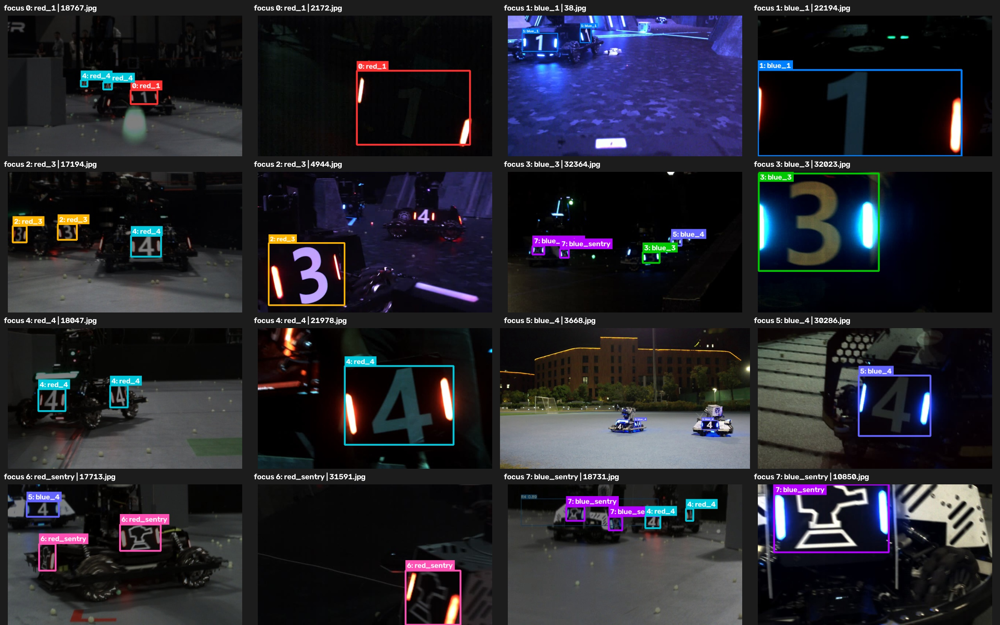
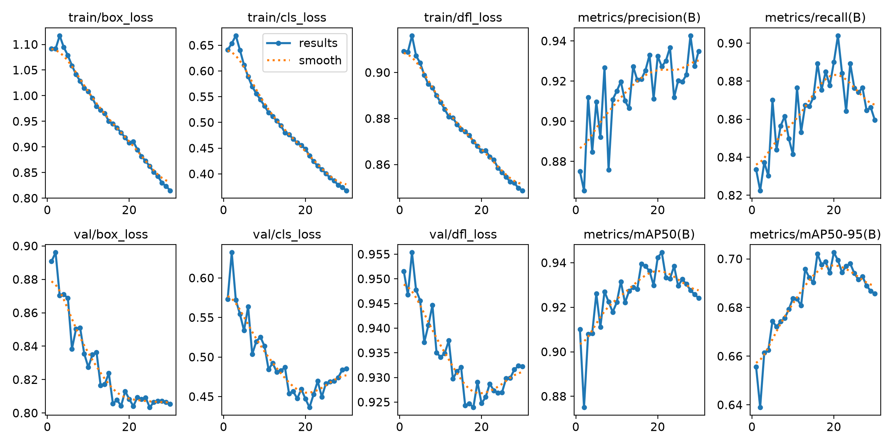
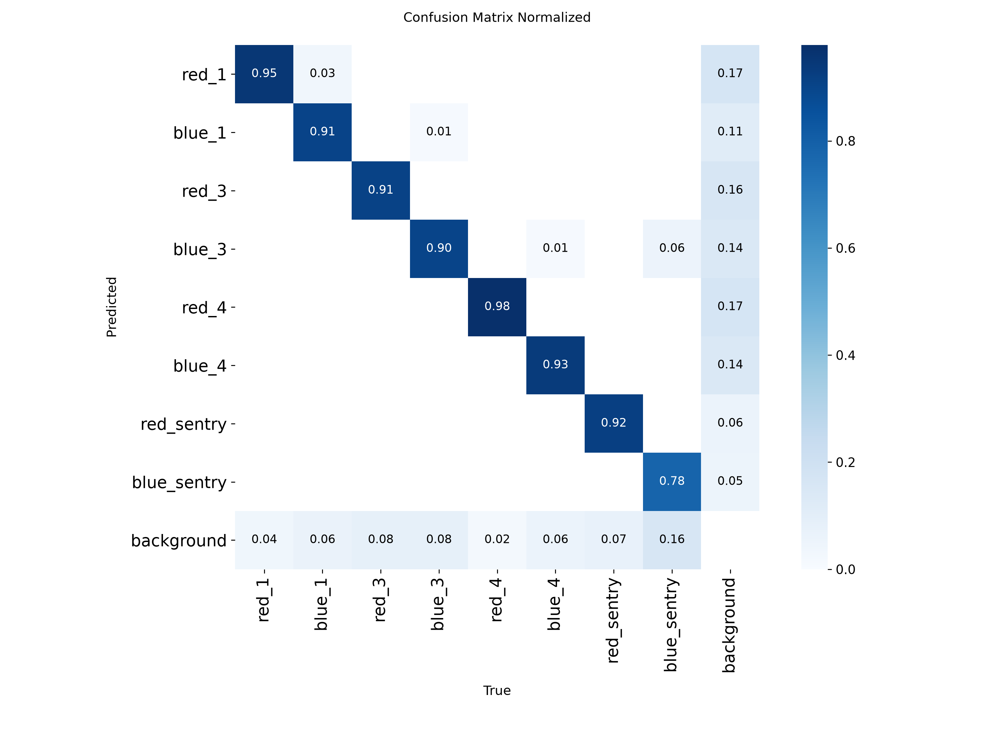
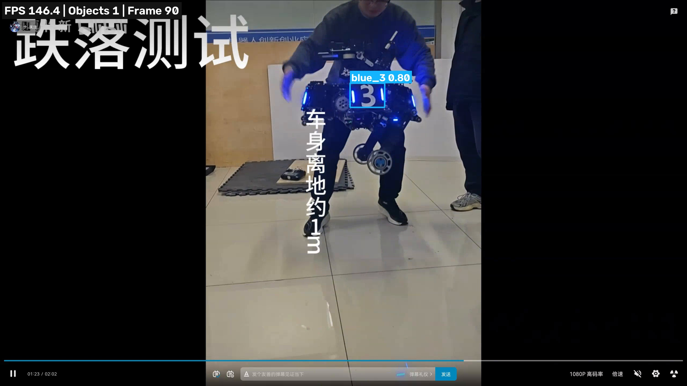

# RoboMaster 装甲板 YOLOv8 目标检测训练报告

## 1. 项目目标

本项目使用 YOLOv8 训练 RoboMaster 装甲板检测模型，实现以下功能：

- 检测装甲板位置并输出矩形框；
- 区分红蓝灯条和装甲板编号；
- 输出类别名称与置信度；
- 对测试视频进行实时推理；
- 保存检测视频、截图、逐帧坐标和性能统计；
- 为后续 ROS 2、Jetson、ONNX 或 TensorRT 部署提供模型基础。

最终采用 YOLOv8s 模型，最佳权重为：

```text
weights/yolov8s_baseline_30_best.pt
```

## 2. 实验环境

| 项目 | 配置 |
|---|---|
| 操作系统 | Ubuntu Linux |
| Python | 3.14.4 |
| PyTorch | 2.13.0+cu132 |
| Ultralytics | 8.4.95 |
| OpenCV | 5.0.0 |
| GPU | NVIDIA GeForce RTX 5070 Ti Laptop GPU |
| 显存 | 12 GB，PyTorch 可用约 11.5 GB |
| CUDA | 13.2 |

## 3. 数据集

### 3.1 数据集结构

数据集位于：

```text
/home/yyr/Downloads/rm
```

目录结构：

```text
rm/
├── train/
│   ├── images/
│   └── labels/
└── val/
    ├── images/
    └── labels/
```

数据配置文件：

```text
configs/rm_armor.yaml
```

### 3.2 数据规模

| 划分 | 图片数量 | 标注文件 | 目标数量 | 无目标负样本 |
|---|---:|---:|---:|---:|
| 训练集 | 20,887 | 20,887 | 46,902 | 12 |
| 验证集 | 3,165 | 3,165 | 5,437 | 9 |
| 合计 | 24,052 | 24,052 | 52,339 | 21 |

数据集约 3.6 GB，包含比赛场地、实验室、暗光、强曝光、远距离小目标、运动模糊、遮挡和多目标等场景。部分图片来自连续视频帧，因此相邻图片具有较强相似性。

### 3.3 类别定义

| 类别 ID | 类别名称 | 含义 | 总目标数 |
|---:|---|---|---:|
| 0 | `red_1` | 红色灯条 1 号装甲板 | 6,374 |
| 1 | `blue_1` | 蓝色灯条 1 号装甲板 | 4,118 |
| 2 | `red_3` | 红色灯条 3 号装甲板 | 8,254 |
| 3 | `blue_3` | 蓝色灯条 3 号装甲板 | 7,467 |
| 4 | `red_4` | 红色灯条 4 号装甲板 | 9,024 |
| 5 | `blue_4` | 蓝色灯条 4 号装甲板 | 4,003 |
| 6 | `red_sentry` | 红色灯条哨兵图案装甲板 | 6,849 |
| 7 | `blue_sentry` | 蓝色灯条哨兵图案装甲板 | 6,250 |

### 3.4 标注格式

标注采用 YOLO 归一化格式：

```text
class_id x_center y_center width height
```

其中坐标和宽高均归一化到 `[0, 1]`。例如：

```text
0 0.057270 0.281919 0.104116 0.085527
```

表示类别 0 的装甲板，其中心点、宽度和高度均按原图尺寸归一化。

### 3.5 数据清洗与检查

检查时发现：

- `train/images/16827.jpg` 为 0 字节损坏文件；
- 该文件没有对应标注；
- 已将其隔离到数据集的 `bad_data` 目录；
- 其余图片与标注一一对应；
- 没有类别越界、坐标越界或宽高非法标注；
- 空标注文件为无目标负样本，予以保留。

使用 `scripts/check_dataset.py` 对训练集和验证集进行完整性检查，并生成标注可视化。

训练集标注样本：



验证集标注样本：



## 4. YOLOv8 原理简述

YOLO 属于单阶段目标检测器，将目标位置回归和类别预测放在一次网络前向计算中完成，速度快，适合 RoboMaster 实时视觉任务。

YOLOv8 检测网络主要由以下部分组成：

1. **Backbone**：提取不同尺度的图像特征，YOLOv8 使用 Conv、C2f 和 SPPF 等模块；
2. **Neck**：融合浅层位置特征和深层语义特征，提高多尺度检测能力；
3. **Detection Head**：分别预测类别和边界框，采用 Anchor-Free 检测方式；
4. **NMS**：删除高度重叠的重复预测框；
5. **Loss**：使用 Box Loss、Classification Loss 和 Distribution Focal Loss 训练框位置与类别。

本任务中远距离装甲板尺寸很小，因此多尺度特征融合对检测效果非常重要。

## 5. 模型与训练配置

### 5.1 模型选择

基线模型采用：

```text
YOLOv8s
```

选择原因：

- YOLOv8n 更轻，但特征提取能力相对较弱；
- YOLOv8m 精度潜力更高，但推理和训练开销更大；
- YOLOv8s 在精度、速度、显存和后续部署之间较平衡；
- 最终模型约 11.13M 参数、28.5 GFLOPs，权重约 22.5 MB。

### 5.2 正式训练参数

训练配置文件：

```text
configs/train_baseline.yaml
```

主要参数：

| 参数 | 数值 | 说明 |
|---|---:|---|
| model | YOLOv8s | COCO 预训练权重 |
| epochs | 30 | 正式训练最大轮数 |
| imgsz | 640 | 训练和验证输入尺寸 |
| batch | 16 | 根据显存实验选择 |
| device | 0 | 使用第一张 CUDA GPU |
| workers | 8 | 数据加载进程数 |
| optimizer | Auto | 实际选择 AdamW |
| patience | 15 | 早停耐心轮数 |
| seed | 42 | 保证实验可复现 |
| AMP | 开启 | 自动混合精度训练 |
| close_mosaic | 10 | 最后 10 轮关闭 Mosaic |
| confidence | 0.40 | 正式视频演示阈值 |

正式 30 轮训练以前先完成 2 轮训练流程试跑，正式实验从该检查点继续初始化模型参数，再执行 30 轮完整训练。

### 5.3 数据增强

基线训练使用 Ultralytics 检测任务默认增强：

| 增强 | 参数 |
|---|---:|
| HSV 色相 | 0.015 |
| HSV 饱和度 | 0.7 |
| HSV 亮度 | 0.4 |
| 平移 | 0.1 |
| 缩放 | 0.5 |
| 水平翻转 | 0.5 |
| Mosaic | 1.0，最后 10 轮关闭 |
| 上下翻转 | 0.0 |
| MixUp | 0.0 |

HSV 增强用于提高模型对灯条曝光、暗光和色彩变化的适应能力；缩放、平移和 Mosaic 用于增加小目标、位置变化和复杂背景样本；没有启用上下翻转，因为真实 RoboMaster 装甲板通常不会上下颠倒。

## 6. 参数实验与选择依据

### 6.1 Batch Size 测试

在 RTX 5070 Ti Laptop 12 GB 上进行显存测试：

| Batch | AMP | 结果 | 峰值显存 |
|---:|---|---|---:|
| 8 | 关闭 | 成功 | 约 3.13 GB |
| 16 | 关闭 | 成功 | 约 5.97 GB |
| 32 | 关闭 | CUDA OOM | 接近全部显存 |

`batch=32` 触发 CUDA Out of Memory，Ultralytics 自动降批后 CUDA 上下文未完全释放，出现 `CUBLAS_STATUS_ALLOC_FAILED`。重新启动独立进程后，`batch=16` 稳定完成训练和验证。因此正式训练选择 `batch=16`，兼顾显存安全性和吞吐率。

### 6.2 Epoch 数量

最初将最大轮数设为 80，但数据集实际有 20,887 张训练图片，远大于任务说明中的约 500 张，并且使用 COCO 预训练权重，因此不需要过多轮次。将正式训练修改为 30 轮。

曲线显示模型在第 20 轮达到最佳 mAP50-95，之后训练 Loss 继续下降，但验证 mAP 小幅回落，说明 30 轮已经足够。

## 7. 训练结果

### 7.1 总体指标

最佳模型位于正式训练第 20 轮。

| 指标 | 结果 |
|---|---:|
| Precision | 0.933 |
| Recall | 0.890 |
| mAP50 | 0.942 |
| mAP50-95 | 0.703 |
| 验证图片 | 3,165 |
| 验证目标 | 5,437 |
| 正式训练时间 | 1.128 小时 |

### 7.2 最佳轮次

第 20 轮的原始记录：

| 指标 | 第 20 轮 |
|---|---:|
| Precision | 0.93242 |
| Recall | 0.88997 |
| mAP50 | 0.94234 |
| mAP50-95 | 0.70264 |
| train/box_loss | 0.90806 |
| train/cls_loss | 0.44860 |
| train/dfl_loss | 0.86587 |
| val/box_loss | 0.80828 |
| val/cls_loss | 0.44714 |
| val/dfl_loss | 0.92473 |

第 21 轮 Recall 和 mAP50 略高，但 mAP50-95 为 0.69943，低于第 20 轮的 0.70264。当前 Ultralytics 版本以 mAP50-95 作为模型 fitness，因此保存第 20 轮为 `best.pt`。

### 7.3 分类别指标

| 类别 | Precision | Recall | mAP50 | mAP50-95 |
|---|---:|---:|---:|---:|
| `red_1` | 0.938 | 0.937 | 0.972 | 0.676 |
| `blue_1` | 0.861 | 0.898 | 0.884 | 0.592 |
| `red_3` | 0.923 | 0.888 | 0.940 | 0.720 |
| `blue_3` | 0.849 | 0.874 | 0.908 | 0.622 |
| `red_4` | 0.985 | 0.968 | 0.991 | 0.849 |
| `blue_4` | 0.944 | 0.908 | 0.968 | 0.722 |
| `red_sentry` | 0.970 | 0.910 | 0.961 | 0.742 |
| `blue_sentry` | 0.990 | 0.735 | 0.915 | 0.698 |

`red_4` 表现最好，mAP50-95 达到 0.849。`blue_1` 和 `blue_3` 的严格定位指标相对较低；`blue_sentry` Precision 很高但 Recall 只有 0.735，说明模型对该类别比较保守，容易漏检暗光或小尺度目标。

## 8. Loss 与 mAP 曲线分析



曲线显示：

- train/box_loss 从约 1.09 下降到 0.815；
- train/cls_loss 从约 0.64 下降到 0.368；
- train/dfl_loss 从约 0.91 下降到 0.849；
- 三个训练 Loss 均稳定下降；
- val/box_loss 在第 20 轮附近趋于稳定；
- val/cls_loss 和 val/dfl_loss 在第 20 轮附近达到较低值，之后略有回升；
- mAP50-95 在第 20 轮附近达到峰值；
- 第 20 轮后出现轻微过拟合，因此最终使用 `best.pt`，而不是第 30 轮的 `last.pt`。

## 9. 混淆矩阵分析



主要对角线比例：

| 类别 | 正确分类比例 |
|---|---:|
| `red_1` | 约 0.95 |
| `blue_1` | 约 0.91 |
| `red_3` | 约 0.91 |
| `blue_3` | 约 0.90 |
| `red_4` | 约 0.98 |
| `blue_4` | 约 0.93 |
| `red_sentry` | 约 0.92 |
| `blue_sentry` | 约 0.78 |

大部分类别的对角线比例超过 0.90。`blue_sentry` 更容易被预测成背景，是后续需要重点补充数据和增强的类别。

## 10. 视频推理

### 10.1 推理脚本

推理脚本：

```text
scripts/predict_video.py
```

支持：

- 视频文件或摄像头输入；
- 检测框、类别、置信度和 FPS 显示；
- 原分辨率结果视频保存；
- 自动截图；
- 逐帧 CSV 坐标输出；
- 推理性能摘要；
- 实时原帧率预览；
- 跨类别 NMS。

### 10.2 短视频测试

测试视频共 343 帧，分辨率 2560×1440，源帧率 27.99 FPS。

| 指标 | 结果 |
|---|---:|
| 总帧数 | 343 |
| 完整流程耗时 | 7.628 秒 |
| 平均端到端 FPS | 44.967 |
| 平均模型推理时间 | 2.713 ms |
| 置信度阈值 | 0.40 |

演示视频：

```text
demo/rm_test_detected.mp4
```

正确检测示例：



### 10.3 长视频实时测试

长测试素材包含夜间运动、跳跃、飞坡、跌落、旋转、红蓝灯条、强反光、遮挡和网页背景等场景。

| 指标 | 结果 |
|---|---:|
| 分辨率 | 2560×1600 |
| 总帧数 | 2,349 |
| 视频时长 | 84.913 秒 |
| 源帧率 | 27.664 FPS |
| 实时处理总耗时 | 90.255 秒 |
| 实时平均 FPS | 26.026 |
| 平均模型推理时间 | 2.492 ms |
| 稳态处理能力 | 约 130～170 FPS |

实时模式主动等待以保持源视频播放速度，因此完整流程平均约 26 FPS；模型本身和不等待时的处理速度明显高于源视频帧率，能够满足实时检测需求。

长视频输出：

```text
demo/rm_long_test_detected.mp4
```

## 11. 遇到的问题及解决方式

### 11.1 数据集中存在损坏图片

问题：`16827.jpg` 为 0 字节空文件，无法由 OpenCV 或 PIL 读取。

解决：训练前将损坏文件移出 `train/images`，重新检查图片与标注配对，确保 20,887 张训练图片均有对应标注。

### 11.2 验证集类别不平衡

问题：验证集 `red_4` 有 2,235 个目标，而 `blue_1` 只有 127 个目标。

解决：除总体 mAP 外，单独分析每个类别的 Precision、Recall 和 mAP50-95，不只依赖一个平均数。报告中明确指出弱类别。

### 11.3 Batch Size 32 显存不足

问题：FP32 下 `batch=32` 触发 CUDA OOM，自动降批后出现 CUDA 上下文残留导致的 CUBLAS 分配失败。

解决：使用全新进程分别测试 batch 8 和 16，最终选择稳定的 batch 16，并使用 AMP 提高训练效率。

### 11.4 预训练权重下载速度慢

问题：终端从 GitHub 下载 YOLOv8s 权重只有几十 KB/s。

解决：使用浏览器完成权重下载，验证文件大小和模型可加载性后复制到项目的 `weights/pretrained` 目录。

### 11.5 视频中出现同框多类别重复检测

问题：默认类别相关 NMS 只抑制同类别框，同一装甲板可能同时输出 `blue_3` 和低置信度 `blue_sentry`。

解决：考虑到装甲板类别互斥，在推理脚本中默认启用跨类别 NMS，并将正式演示阈值从 0.25 提高到 0.40，减少重复框和低置信误检。

### 11.6 后期轻微过拟合

问题：第 20 轮后训练 Loss 继续下降，但 Recall 和 mAP50-95 逐步回落。

解决：使用 Ultralytics 自动保存的最佳验证权重 `best.pt`，不使用最后一轮 `last.pt`；不再增加训练轮数。

### 11.7 独立视频出现类别误判

问题：部分强反光、倾斜或运动模糊的红色 4 号装甲板会被预测成 `red_1`，颜色不明显时也可能出现红蓝判断错误。

解决方向：补充独立视频中的困难样本，特别是蓝色 1 号、蓝色 3 号、蓝色哨兵和倾斜红色 4 号；后续可采用针对性重采样、亮度增强和难例微调。

## 12. 客观评价与局限

模型在当前验证集上达到 mAP50 0.942 和 mAP50-95 0.703，作为 YOLOv8s 装甲板检测基线表现良好，明显满足本阶段基础考核要求。

但仍存在以下局限：

- 数据中有大量连续视频帧，训练集和验证集场景可能较相似；
- 独立视频中仍可观察到运动模糊和强反光导致的类别误判；
- `blue_sentry` Recall 较低；
- 普通水平检测框不能直接提供装甲板四角点和姿态；
- RTX 5070 Ti 的速度不能直接代表 Jetson 性能；
- 尚未在 Jetson 或 TensorRT 上完成实际部署测速。

因此当前模型适合作为装甲板检测和视频演示模型；若用于自动瞄准，还需要关键点、PnP、时序跟踪和滤波等模块。

## 13. 复现命令

### 13.1 检查数据集

```bash
/home/yyr/pytorch-env/bin/python scripts/check_dataset.py --split train
/home/yyr/pytorch-env/bin/python scripts/check_dataset.py --split val
```

### 13.2 训练模型

```bash
/home/yyr/pytorch-env/bin/python scripts/train.py
```

### 13.3 视频推理

```bash
/home/yyr/pytorch-env/bin/python scripts/predict_video.py \
  "/path/to/test.mp4" \
  --conf 0.40 \
  --output demo/test_detected.mp4 \
  --screenshot-interval 200 \
  --max-screenshots 10
```

### 13.4 实时预览

```bash
/home/yyr/pytorch-env/bin/python scripts/predict_video.py \
  "/path/to/test.mp4" \
  --conf 0.40 \
  --show \
  --realtime \
  --display-width 960 \
  --output /tmp/rm_preview.mp4 \
  --screenshot-interval 0
```

## 14. 提交文件

| 提交内容 | 文件路径 |
|---|---|
| 数据配置 | `configs/rm_armor.yaml` |
| 训练配置 | `configs/train_baseline.yaml` |
| 数据检查脚本 | `scripts/check_dataset.py` |
| 训练脚本 | `scripts/train.py` |
| 推理脚本 | `scripts/predict_video.py` |
| 最佳权重 | `weights/yolov8s_baseline_30_best.pt` |
| 短演示视频 | `demo/rm_test_detected.mp4` |
| 长演示视频 | `demo/rm_long_test_detected.mp4` |
| 演示截图 | `demo/screenshots/`、`demo/rm_long_test_detected_screenshots/` |
| Loss/mAP 曲线 | `logs/train/yolov8s_baseline_30/results.png` |
| 混淆矩阵 | `logs/train/yolov8s_baseline_30/confusion_matrix.png` |
| 原始指标 | `logs/train/yolov8s_baseline_30/results.csv` |
| 训练报告 | `report/training_report.md` |

## 15. 结论

本项目完成了 RoboMaster 八类装甲板数据清洗、YOLOv8s 训练、指标评估、最佳模型选择、视频推理和实时性能测试。模型最佳 mAP50 为 0.942，mAP50-95 为 0.703，在 RTX 5070 Ti 上能够实时处理高分辨率视频。独立视频验证表明模型对蓝色 3 号和红色 4 号等常见装甲板具有较好的检测能力，同时也暴露了强反光、运动模糊和弱类别上的误判问题，为后续针对性增强和部署优化提供了依据。
